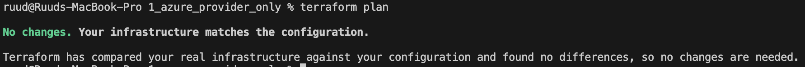

1. **Initialize the Terraform Environment**: Use `terraform init` to initialize your Terraform environment. This step downloads the specified version (3.88.0) of the Azure provider and prepares your working directory for further Terraform operations.
```bash
terraform init
```

2. **Format the File**: fmt is a command in Terraform that automatically formats your Terraform code files to follow a consistent and organized style.
```bash
terraform fmt
```

3. **Review the Execution Plan**: Use terraform plan to generate an execution plan. This step compares your desired infrastructure state with the current state and displays the actions Terraform will take.
```bash
terraform plan
```

This is the result so no further actions would result into changes.
