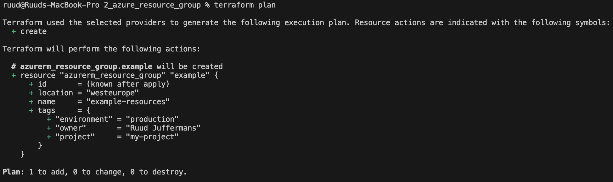

# Azure Provider Terraform File

1. **Initialize the Terraform Environment**
```bash
terraform init
```

2. **Format the File**
```bash
terraform fmt
```

3. **Review the Execution Plan**
```bash
terraform plan
```
This is the result:


4. **Deploy the Plan**
```bash
terraform apply
```

5. **Destroy the Resources**
```bash
terraform destroy
```