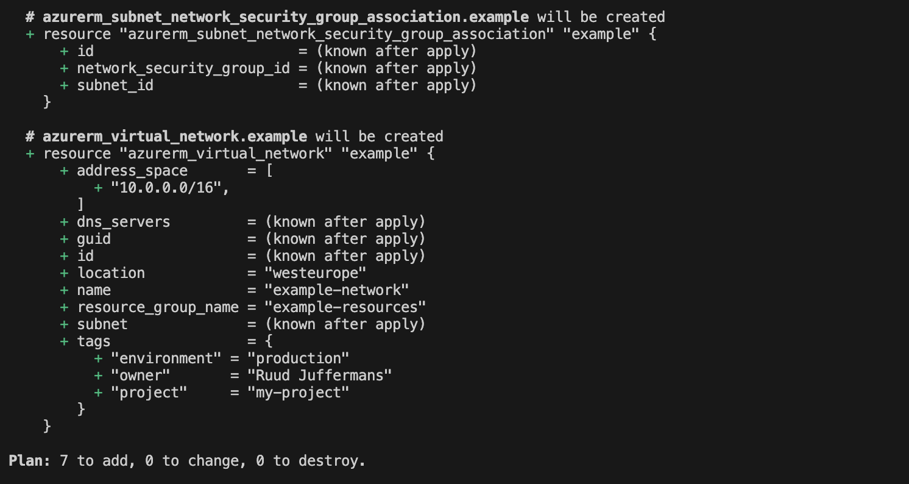
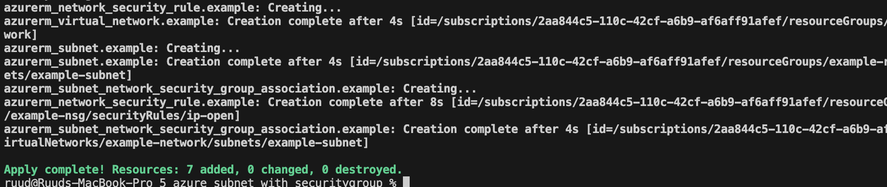

# Azure Subnets

1. **Initialize the Terraform Environment**
```bash
terraform init
```

2. **Format the File**
```bash
terraform fmt
```

3. **Review the Execution Plan**
```bash
terraform plan
```
This is the result:


4. **Deploy the Plan**
```bash
terraform apply --auto-approve
```
This is the result:


5. **Show State**
```bash
terraform state list
```

6. **Review Destroy Plan**
```bash
terraform plan --destroy
```

7. **Destroy the Resources**
```bash
terraform destroy --auto-approve
```